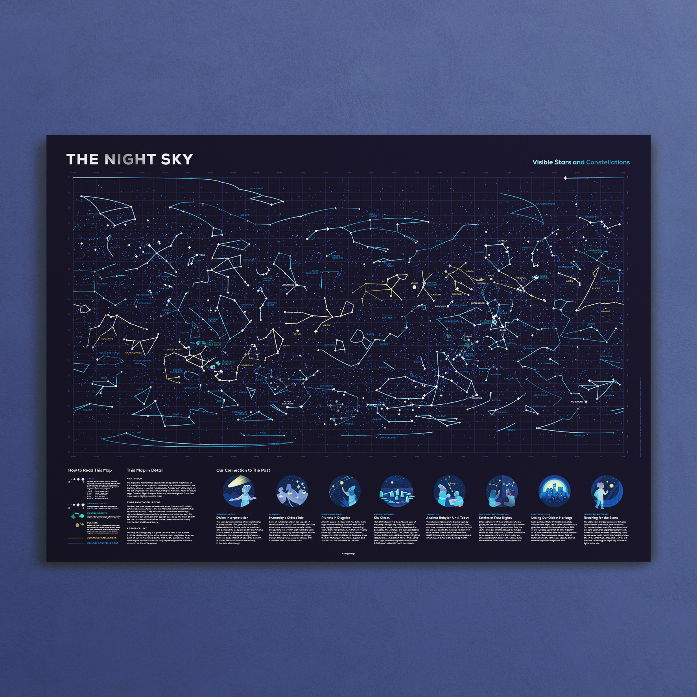

# The Night Sky

## Visible Stars and Constellations

Here goes the product description text

**Get your own **[**The Night Sky Poster**](https://shop.kurzgesagt.org/)

------

**Notice:** This repository is a modified version of the project [The Western Constellations](https://github.com/eleanorlutz/western_constellations_atlas_of_space) from Eleanor Lutz, shared under the [GPL-3.0 license](https://www.gnu.org/licenses/gpl-3.0). If you like to read more about her process, code and thoughts behind the project, take a look at the original [repository](https://github.com/eleanorlutz/western_constellations_atlas_of_space).

<a name="sources"/>

## Sources

- [Sources & further reading](https://kgs.link/nightsky) – Our source document.
- [Eleanor Lutz](https://github.com/eleanorlutz) – Thanks for making your code available on GitHub.

<a name="data"/>

## Data

- [Concise Catalog of Deep-sky Objects](https://www.springer.com/us/book/9781852338510). W.H. Finlay. Springer 2003.
- [Urania's mirror, or, A view of the heavens](https://www.loc.gov/item/2013645050/). Richard Rouse Bloxam, Sidney Hall, and Jehoshaphat Aspin. Samuel Leigh 1824.
- [Unicode Character Table](https://unicode-table.com/en/). Sergei Asanov and Oleg Grigoriev. 2019.
- [HYG Database version 3](http://www.astronexus.com/hyg). David Nash. 2019.
- [Western Constellation Lines](http://hemel.waarnemen.com/download/#cetera). Marc van der Sluys 2005.
- [Catalogue of Constellation Boundary Data](http://cdsarc.u-strasbg.fr/viz-bin/Cat?VI/49#sRM2.2). A.C. Davenhall and S.K. Leggett. Royal Observatory Edinburgh 1989.
- [Stellarium](https://stellarium.org/) 2019 version 0.19.0.

<a name="license"/>

## License

**Code:** All of the code in this repository is shared under the [GPL-3.0 license](https://www.gnu.org/licenses/gpl-3.0).

**Data:** The data in this repository belongs to the original authors of the data. Please use the references section to look up the original version. 

<a name="about"/>

## About

### **ABOUT KURZGESAGT**

We are a Germany based animation studio, production house and design studio. We produce elaborate science videos for our YouTube channel and create high-quality paper products for this shop.

We put countless hours into the creation of our products. They are all designed with love and produced with great care. They are more than merch and nothing short of a passion project for us.

Everything we do is meant to spark your curiosity for science, nature, human beings and life itself.

[**Shop**](https://shop.kurzgesagt.org/)
